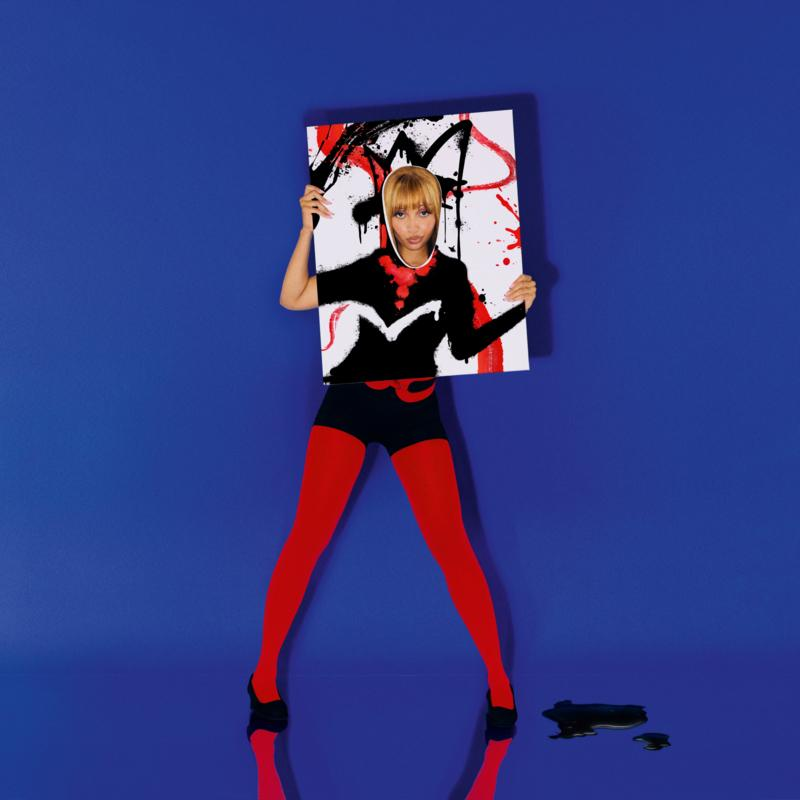

# PinkPantheress text archive
Collection of PinkPantheress texts around the world.

You can receive automated texts from PinkPantheress at +1 (917) 810-3401 [over SMS/MMS in the United States, Canada, and Puerto Rico](https://my.community.com/pinkpantheress); or [on WhatsApp internationally (excluding the United States, Canada, and Puerto Rico)](https://pinkpantheress.lnk.to/textme).

**This page is a work in progress!** If you see a text missing here (excluding placeholders), or see something that needs to be verified, and think you might be able to help, DM me on Twitter or Instagram (same @)!

## Texting WhatsApp in the United States, Canada, or Puerto Rico
```
System Message: Your number is in a region that currently does not support WhatsApp with PinkPantheress.

Click the link to get started on SMS. sms:+19178103401
```

## `HELP` keyword text pre-activation
```
This is a conversation with PinkPantheress.

Have questions?
community.com/help

Manage Preferences:
https://member.community.com/profile

To begin messaging you need to complete registration by clicking the link above.
```

## `HELP` keyword text post-activation
```
This is a conversation with PinkPantheress.

Have questions?
community.com/help

Manage Preferences:
https://member.community.com/profile

If you no longer want to receive these messages, simply reply STOP. To resume messaging text START.
```

## "Why did I get this?" keyword text
```
You are opted in to receive messages from PinkPantheress. If you no longer wish to receive these messages, text STOP to unsubscribe.
```
<sub>This response will only appear after you have completed registration.</sub>

## `STOP` keyword text pre-activation
```
You are opted out and won't receive any more messages from this number. Complete registration to begin messaging. Text HELP for more.
```
<sub>In my testing on both SMS/MMS and WhatsApp, texting HELP for more doesn't actually work.</sub>

## `STOP` keyword text post-activation
```
You're opted out and won't receive any more messages from PinkPantheress.
Message START to rejoin.
```

## `START` keyword text
```
Welcome back. Message STOP to cancel
```

## "Finish signing up" text
```
hey it's pinkpantheress, how did we get here idk but click the link to finish signing up
https://community.com/signup-notice
```

## Introduction/welcome text
```
here's some cute backgrounds for our chats! hope you devour🥵
https://pinkpantheress.lnk.to/bgs?utm_source=community.com&utm_medium=sms Msg frequency will vary. Msg&Data rates may apply. Reply HELP for help, STOP to cancel.
```
[[contact attachment]](./contact.vcf)

[<sub>[1] `https://pinkpantheress.lnk.to/bgs?utm_source=community.com&utm_medium=sms` -> `https://www.dropbox.com/scl/fo/6to56fq9u2fcr11p2zfw1/ACoC9kTOtlRtQ1en-Z1gfFY?rlkey=tvmmp57fx0b9avelyjkcejg5l&e=1&st=dn619lu2&utm_medium=sms&utm_source=community.com&dl=0`</sub>](https://www.dropbox.com/scl/fo/6to56fq9u2fcr11p2zfw1/ACoC9kTOtlRtQ1en-Z1gfFY?rlkey=tvmmp57fx0b9avelyjkcejg5l&e=1&st=dn619lu2&utm_medium=sms&utm_source=community.com&dl=0)<br>
<sub>This text is sent on both SMS/MMS and WhatsApp, even though the backgrounds are intended for WhatsApp chats.</sub>

<hr>

## "Tonight" single artwork reveal text
*Sent worldwide at Friday, March 28th, 2025 7:00PM UTC*

## "Tonight" music video release text
*Sent worldwide at Friday, April 4th, 2025 3:15PM UTC*

## "Fancy That" release text
*Sent worldwide at Monday, April 7th, 2025 6:00PM UTC*

## "Fancy That" ticket teaser text
*Sent to United Kingdom\* at Tuesday, April 8th, 2025 9:15PM UTC*

<sub>\*Or perhaps only London? Need to verify!</sub>

## London show tickets text
*Sent to United Kingdom\* at Monday, April 14th, 2025 8:50PM UTC*

<sub>\*Or perhaps only London? Need to verify!</sub>

## Spotify x PinkPantheress Clubhouse text
*Sent to United Kingdom\* and United States\*\* at Wednesday, April 23rd, 2025 3:00PM UTC*

<sub>\*Or perhaps only London? Need to verify!</sub><br>
<sub>\**Or perhaps only New York? Need to verify!</sub>

## UK signing tour announcement text
*Sent to United Kingdom at Thursday, April 24th, 2025 6:00PM UTC*

## UK signing tour sale text
*Sent to United Kingdom at Friday, April 25th, 2025 11:00AM UTC*

## Banquet show ticket text
*Sent to United Kingdom at Friday, April 25th, 2025 6:00PM UTC*

## Stateside video announcement text
*Sent worldwide at Friday, April 25th, 2025 9:00PM UTC*

## Store (April 28th) (need to name)
*Sent worldwide at Monday, April 28th, 2025 6:00PM UTC*

## "Fancy that" Assai Records vinyl signing text
*Sent worldwide (verify) at Tuesday, April 29th, 2025 5:15PM UTC*

## Come to New York text
*Sent worldwide (verify) at Wednesday, April 30th, 2025 10:00AM UTC*

## "Fancy that" hype text
*Sent worldwide at Wednesday, April 30th, 2025 8:00PM UTC*

## "Fancy that" release text
*Sent worldwide at Friday, May 9th, 2025 3:30PM UTC*

## "Illegal" music video release text
*Sent worldwide at Friday, May 9th, 2025 9:30PM UTC*

## Mug and plate merch announcement text
*Sent worldwide (verify) at Monday, May 12th, 2025 11:30AM UTC*

## "An Evening with PinkPantheress" show reminder text
*Sent to United Kingdom\* at Friday, May 16th, 2025 6:30PM UTC*

<sub>\*Or perhaps only London? Need to verify!</sub>

## "Fancy that" ringtones announcement text
*Sent worldwide at Friday, June 6th, 2025 6:00PM UTC*

## "A Special Evening with PinkPantheress" London show RSVP text

*Sent to United Kingdom\* at Wednesday, June 11th, 2025 6:30PM UTC*

<sub>\*Or perhaps only London? Need to verify!</sub>

## "Fancy Some More?" release text
*Sent worldwide at Friday, October 10th, 2025 2:00PM UTC*
```
got together with some fab artists from around the world to bring you 'fancy some more' and it's out now!! 🥹 https://pinkpantheress.lnk.to/fancysomemore?utm_source=community.com&utm_medium=sms
```


## "To hell with it" sparkle vinyl text
*Sent at Wednesday, October 15th, 2025 4:30PM UTC*
```
happy to hell with it day 🥹 i heard you guys.. so to celebrate 4 years, i'm releasing a sparkle vinyl!! you can pre-order it now https://pinkpantheress.lnk.to/thwi?utm_source=community.com&utm_medium=sms
```
